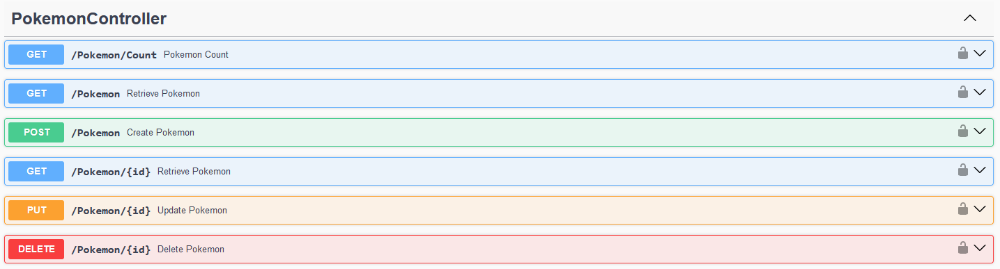
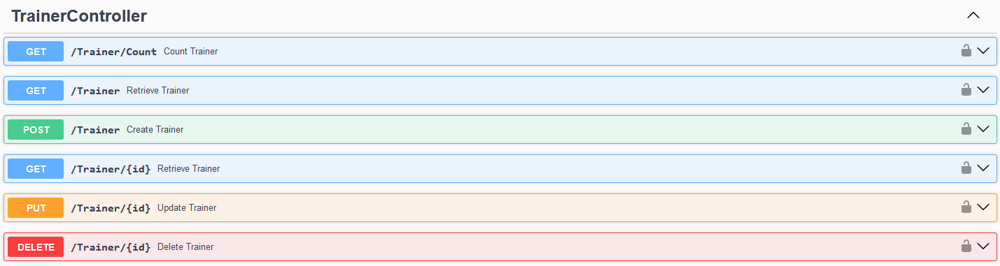

# Pokémon

Repository to host the project developed for Desenvolvimento Web II, a 2024 subject at UMAIA. Developed by Group 09: [@HugoTeixeiraMartins](https://github.com/HugoTeixeiraMartins), [@N0rtenh0](https://github.com/N0rtenh0) and [@Joaosa330](https://github.com/Joaosa330).

## Short theme description

This project is an implementation of a Pokémon management system utilizing OAuth 2.0 for authentication via GitHub. It is developed to showcase a structured approach to handling various aspects of Pokémon management through a set of well-defined RESTful APIs. The project includes Dockerized containers for easy deployment and integration.

## Repository organization

* Report chapters are in [docs folder](Doc_M1).
* Screenshots are in the [prints folder](Doc_M1).

## Gallery

| Page      | Image |
| ----------- | ----------- |
| Login Page  |        |
| Home Page |        |
| Pokémon Controllers      |        |
| Trainer Controllers   |        |
| Tipo Controllers | ](prints/image-5.png)       |
| Battles Controllers      |        |
| Teams Controllers      |        |
| Docker Containers   |        |

## Technologies

* [HTML5](https://html.spec.whatwg.org/multipage/) + [CSS3](https://www.w3.org/Style/CSS/)
* [Javascript](https://developer.mozilla.org/en-US/docs/Learn/JavaScript)
* [PHP](https://www.php.net/)
* [nodeJS](https://nodejs.org/en/)

### Frameworks and Libraries

* Docker: Used for containerizing the application and its dependencies.
* NodeJS: Backend runtime for building the API.
* Express.js: Framework used for building the RESTful API.
* Passport.js: Middleware for authentication, specifically with GitHub OAuth 2.0 in this project.
* Swagger: For API documentation and testing.
* JQuery: For handling JavaScript operations on the frontend.
* Bootstrap: For styling and responsive design.
* GitHub OAuth 2.0: For user authentication.

### Project presentation
* Chapter 1 :[Project presentation](Doc_M1/c1.md)
### Resources
* Chapter 2 :[Resources](Doc_M1/c2.md)
### Product
* Chapter 3 :[Product](Doc_M1/c3.md)

## Grupo _09_
* Hugo Martins | a043898
* João Sá | a042256
* André Rodrigues | a041851
